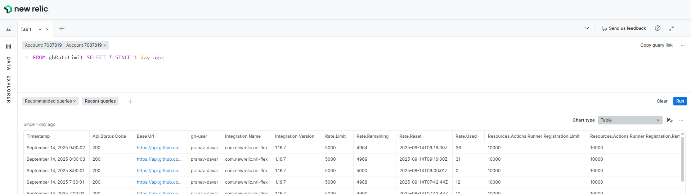

# 🚀 Rate Limit Monitoring

An automated way to ingest GitHub rate limit metrics and understand about  remaining quota for a user.

---

## 🎯 About the Project

While using GitHub Actions, PAT tokens are configured and are used to call APIs like GitHub Copilot, PR requests, etc.. The automated workflow fails due to rate limits imposed by GitHub. There is no way to ingest output from the rate limit API to the New Relic.

This project takes the above as the problem statement. NewRelic flex integration configured to capture the rate limit every **n** minutes, which fetches the available quota for a user by calling [GitHub rate limit API](https://docs.github.com/en/rest/rate-limit/rate-limit?apiVersion=2022-11-28). 

---

## ⚡Key Features

- ✅ Standalone **nri-flex** integration with .yml configuration.
- ✅ Publish rate limits custom events to new relic after every n minutes.
- ✅ Encrypted token
- ✅ Visualise the trend of quota consumption on New Relic
- ✅ Can be configured for multiple users.
---

## 🛠️ Tech Stack

- [New Relic](https://newrelic.com/welcome-back)
- [Nri-Flex Standalone Integration](https://github.com/newrelic/nri-flex/releases/tag/v1.16.7)
- [crontab](https://man7.org/linux/man-pages/man5/crontab.5.html)
- [GitHub Rate Limit API](https://docs.github.com/en/rest/rate-limit/rate-limit?apiVersion=2022-11-28)

---

## 🧑‍💻 How to Run Locally

The steps mentioned below are for linux(ubuntu) operating system.

### Prerequisites
- crontab
- git
- New Relic Account
- GitHub Account
- [GitHub Personal Access Token](https://docs.github.com/en/authentication/keeping-your-account-and-data-secure/managing-your-personal-access-tokens)

### Steps:

1. Clone the repository and change directory to **01-rate-limit-monitoring**.

```bash
# Clone the repository
git clone https://github.com/pranav-davar/new-relic-o11y-hackathon-2025.git

# Navigate into the project folder
cd 01-rate-limit-monitoring

# download nri-flex standalone.
wget https://github.com/newrelic/nri-flex/releases/download/v1.16.7/nri-flex_linux_1.16.7_amd64.tar.gz

# Extract the nri-flex executable
tar -xvzf nri-flex_linux_1.16.7_amd64.tar.gz
```
_latest: [Nri-Flex Standalone Integration](https://github.com/newrelic/nri-flex/releases)_

2. Open the file rate.yml in the choice of text editor. Update the **_secret.user1.data_** with the encrypted key value pair of id and token separated by ','.

3. To get the encrypted value, run the below command by updating github-user with actual github username or reference to the user, token with github PAT token.

```sh
./nri-flex -encrypt_pass 'id=github-user,token=gh-token' -pass_phrase 'pass-phrase'
```

#### OUTPUT:

```sh
INFO[0000] com.newrelic.nri-flex                         GOARCH=amd64 GOOS=linux version=1.16.7
INFO[0000] *****Encryption Result*****
INFO[0000]    encrypt_pass: id=github-user,token=gh-token
INFO[0000]     pass_phrase: pass-phrase
INFO[0000]  encrypted pass: eb1b7007135e02d480ae3fc62a275766f02187aa1bcdd1df50de10ed6f0bd5130dc3677274e95058435cabf639a6c56ca4fe87b7b67f7a9bbb
FATA[0000] config: failed to read configuration folder   dir=flexConfigs/ error="open flexConfigs/: no such file or directory"
```
_Use the encrypted pass:_

4. Run and validate the configuration.

```sh
# Set passkey environment variable to the pass-phrase used in earlier step to encrypt the data
export passkey=pass-phrase

# Run the nri-flex with rate.yml configuration
./nri-flex -config_path rate.yml -verbose -pretty

```

Validate the output, see if the output data is populated properly i.e. output contains rate limit and quota information from GitHub rate limit REST API.

5. To send data to new relic, open the script.sh in any text editor.

6. Update passkey, new-relic ingest key, and account id. Run the script by running the below command.

```sh
./script.sh
```

Run the above script multiple times to get multiple records in New Relic.

7. Login to New Relic account. Go to data explorer. Execute the below nrql to visualise the data.

```sql
FROM ghRateLimit SELECT * SINCE 1 day ago
```

The output will look like

 

8. To extend the solution for another user, uncomment the user2 details in both **secrets and apis**. Update the details as was done for user1. Repeat the above steps, to visualise the data in New Relic for user2.

9. To run the script every **30** minute. Create a cronjob.

```sh
# open cron configurations 
crontab -e

# this will open cron configurations in default text editor
# append the below line at the bottom of the file

*/30 * * * * /path-to-git-repo/01-rate-limit-monitoring/script.sh 2>> /path-to-git-repo/01-rate-limit-monitoring/script.sh/error.log
```

_Update the path-to-git-repo to the absolute path of checked out git repo. Save and close the cron configuration._

**Cron expression:** */30 * * * *

The above cron expression will run the script every 30 minutes.

## 🎯 Future Improvements

- Extend solution for limit APIs for other SaaS/PaaS services.
- Setup alerts if rate limit goes beyond a certain point.

## 💡 Hackathon Info

- 🏆 **Hackathon Name**: New Relic O11y Hackathon 2025
- 📅 **Date**: 15th September'2025
- 🚀 **Team Members**: Pranav Davar  

---

## 🙏 Acknowledgements

Thanks to the hackathon organizers who made this possible.

---

📬 Feel free to connect:  
| [LinkedIn](https://www.linkedin.com/in/pranavdavar/) | [Blog](https://blog.deciphermiddleware.in/) | [Medium](https://medium.com/@pranavdavar9) |
