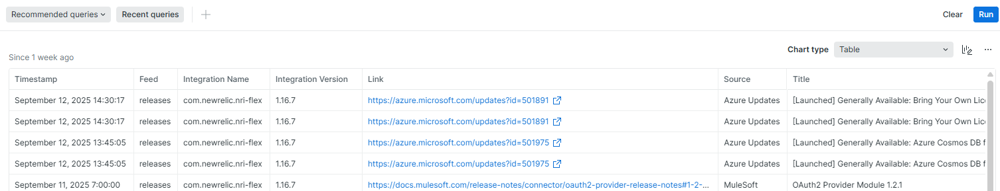

# 🚀 RSS2Relic

Aggregating RSS Feeds and Publishing Insights to New Relic.

---

## 🎯 About the Project

This is designed to streamline the process of collecting, analyzing content from multiple RSS feeds. It fetches RSS content from various sources, processes the data, and publishes key insights to New Relic as custom events. This enables organizations to gain visibility into content trends, new features, releases, etc. all within the New Relic observability platform. This will help users to make informed decision based on any new trends, without hopping to multiple sites.

---

## ⚡Key Features

- ✅ Standalone **nri-flex** integration with .yml configuration.
- ✅ Publish any new rss feed custom events to new relic after every n minutes.
- ✅ Visualise updates and trends from multiple source at one platform i.e. New Relic
- ✅ Can be configured for multiple sources by just changing lookup file i.e. **rss-vars.json**.
- ✅ Currently rss-vars.json is preloaded with configuration for the feeds from **Azure** and **MuleSoft**.

---

## 🛠️ Tech Stack

- [New Relic](https://newrelic.com/welcome-back)
- [Nri-Flex Standalone Integration](https://github.com/newrelic/nri-flex/releases/tag/v1.16.7)
- [MuleSoft Docs RSS Feed](https://docs.mulesoft.com/releases.rss)
- [Azure RSS Feed](https://www.microsoft.com/releasecommunications/api/v2/azure/rss) 
- [jq](https://jqlang.org/manual/)

---

## 🧑‍💻 How to Run Locally

The steps mentioned below are for linux(ubuntu) operating system.

### Prerequisites
- New Relic Account
- [jq](https://jqlang.org/manual/)

### Steps:

1. Clone the repository and change directory to **02-rss2relic**.

```bash
# Clone the repository
git clone https://github.com/pranav-davar/new-relic-o11y-hackathon-2025.git

# Navigate into the project folder
cd 02-rss2relic

# download nri-flex standalone.
wget https://github.com/newrelic/nri-flex/releases/download/v1.16.7/nri-flex_linux_1.16.7_amd64.tar.gz

# Extract the nri-flex executable
tar -xvzf nri-flex_linux_1.16.7_amd64.tar.gz
```
_latest: [Nri-Flex Standalone Integration](https://github.com/newrelic/nri-flex/releases)_

2. Open the lookup file rss-vars.json. Update or add rss configurations.

```json
[    
    {
        "host":"https://rssfeedurl",
        "source": "RSS source Name",
        "feed": "releases",
        "id": "unique identifier for RSS feed ingestion",
        "tFormat": "Timestamp format that is returned from RSS feed. For example: Mon, 02 Jan 2006 15:04:05 MST"
    }
]
```
For more details on time format visit: [link](https://go.dev/src/time/format.go)


3. Open script.sh, update new-relic ingest key, path to working directory and account id. Run the script by running the below command.

`Everytime, script runs. It will extract data which is newer than the previous run.`

```sh 
# ./script.sh <json_file> [reset] [sendData]
# json_file = rss-vars.json
# reset : if you want to reset it to include all data from rss feed not after the last run publish date time
# sendData : sending data to new relic. Use with reset, if you are running for the first time to send to new relic
./script.sh rss-vars.json
```
Validate the output, see if the output data is populated properly i.e. output contains title, link of from the available rss feeds.

4. To send data to new relic, execute below command.

```bash
# send data to new relic for the first time
./script.sh rss-vars.json reset sendData

# send data to new relic for subsequent runs.
./script.sh rss-vars.json sendData
```

5. Login to New Relic account. Go to data explorer. Execute the below nrql to visualise the data.

```sql
FROM rss-feed SELECT * since 1 days ago
```

The output will look like



6. To extend the solution for another user, uncomment the user2 details in both **secrets and apis**. Update the details as was done for user1. Repeat the above steps, to visualise the data in New Relic for user2.

7. To run the script every **30** minute. Create a cronjob.

```sh
# open cron configurations 
crontab -e

# this will open cron configurations in default text editor
# append the below line at the bottom of the file

*/30 * * * * /path-to-git-repo/02-rss2relic/script.sh 2>> /path-to-git-repo/02-rss2relic/script.sh/error.log
```

_Update the path-to-git-repo to the absolute path of checked out git repo. Save and close the cron configuration._

**Cron expression:** */30 * * * *

The above cron expression will run the script every 30 minutes.

## 🎯 Future Improvements

- Create a dashboard to visualise the rss feed.

## 💡 Hackathon Info

- 🏆 **Hackathon Name**: New Relic O11y Hackathon 2025
- 📅 **Date**: 15th September'2025
- 🚀 **Team Members**: Pranav Davar  

---

## 🙏 Acknowledgements

Thanks to the hackathon organizers who made this possible.

---

📬 Feel free to connect:  
| [LinkedIn](https://www.linkedin.com/in/pranavdavar/) | [Blog](https://blog.deciphermiddleware.in/) | [Medium](https://medium.com/@pranavdavar9) |
